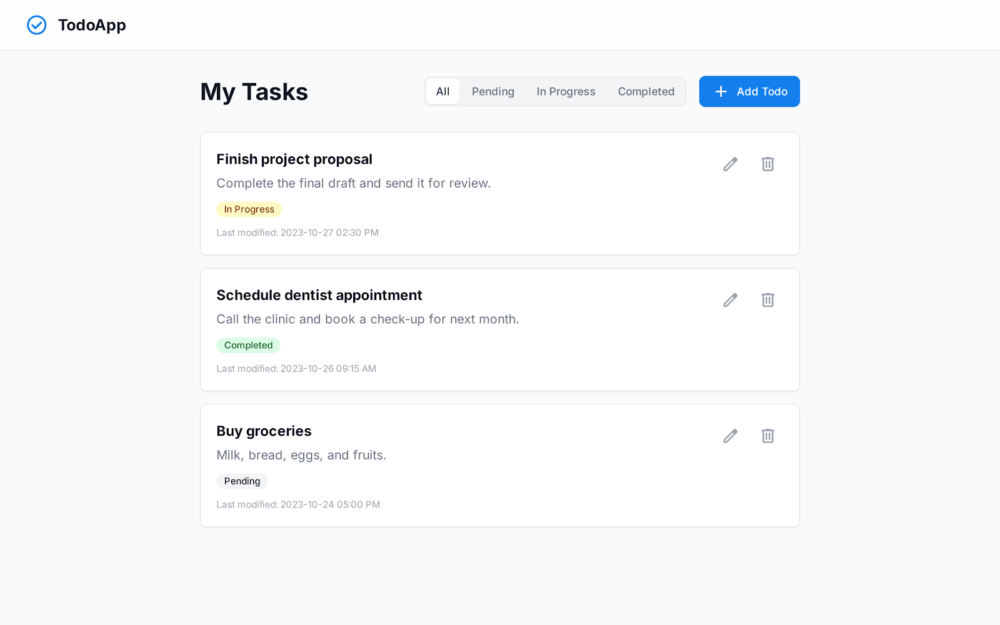
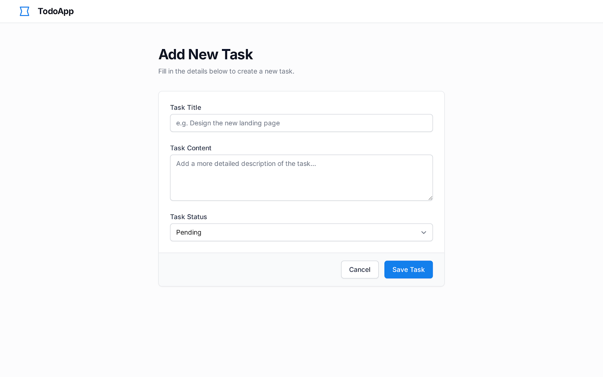

需求:
我要做一個 task 網頁 for 個人 task 管理 
增刪改查 
需要有 分頁機制 和 task 的狀態 Pending, In Progress, Completed 
在列表頁能夠過濾 選擇過濾 
我要有的頁面有 列表頁, 新增頁, 編輯頁, 刪除需要彈出視窗確認 
我不需要有搜索功能, 通知功能 和 用戶登入功能 
task 需要有以下內容 標題, 內容, 最後編輯時間, task 狀態

UI design : 
> powered py Google stitch ai
- list page

- modify page

